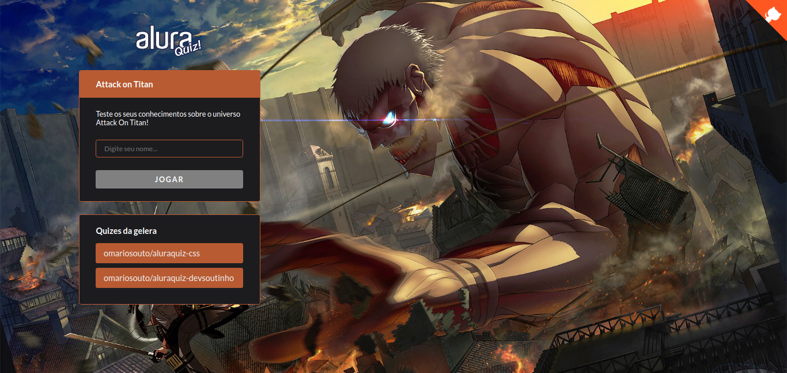
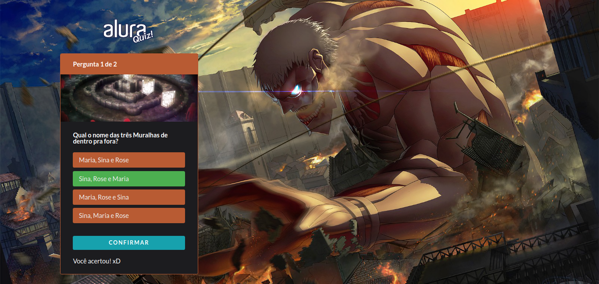

  

<h1 align="center">Attack On Titan Quiz</h1>

  

<h3>Projeto feito durante a semana de Imersão React/NextJs da Alura.</h3>

<a href="https://attack-on-titan-quiz.th1ag0-zz.vercel.app/">Link para acessar o Quiz</a>

---

## :star: Tecnolgias usadas:
* [ReactJS](https://pt-br.reactjs.org/)
* [NextJS](https://nextjs.org/)
* [StyledComponents](https://www.styled-components.com/)
* [FramerMotion](https://www.framer.com/motion/)

  

## :alien: Layout no Figma:
* [Aqui](https://www.figma.com/file/cg1MIzSRRss8ggpypQbmdD/AluraQuiz?node-id=0%3A1)